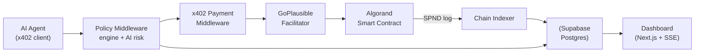
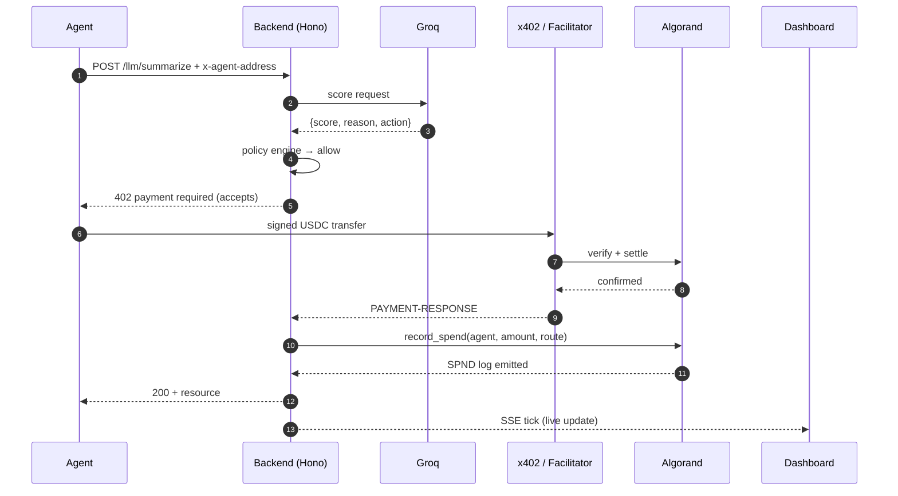

<div align="center">

# AgentGuard

**Programmable treasury and policy layer for autonomous AI agents — on Algorand + x402.**

[](https://www.typescriptlang.org/)
[](https://nextjs.org/)
[](https://hono.dev/)
[](https://algorand.co/)
[](https://x402.org)
[](https://groq.com/)
[](https://supabase.com/)
[](https://www.prisma.io/)
[](#license)

AgentGuard is a drop-in Hono middleware, on-chain smart contract, and dashboard that lets autonomous AI agents transact under spending limits **the chain itself enforces**. Every USDC payment carries an unforgeable on-chain receipt; every over-limit request is refused before it leaves the wallet.

</div>

---

## The Problem

Autonomous agents can call paid APIs, spin up cloud jobs, and buy data on their own — but nothing stops a compromised, prompt-injected, or looping agent from burning a treasury by morning. Traditional payment rails were built for human checkouts, not programs signing 400 calls per second, and app-layer spend caps are only as trustworthy as the middleware around them. **x402 + Algorand** puts the payment and the policy in the same atomic step, so violating the policy means the payment simply doesn't happen.

## The Solution

AgentGuard sits between the agent and the paid endpoint. Every request runs through a **policy engine** (allow-list, daily/monthly caps, human-approval threshold) and an **AI risk scorer** before x402 is even asked to quote a price. When a payment settles, an on-chain `record_spend` call debits the agent's on-chain box and emits a tamper-proof event the dashboard streams live. Owners write policies in plain English; the LLM parses them into typed JSON the smart contract can enforce.

## Key Features

| | |
|---|---|
| 💳 **x402 micropayments** | Real per-request USDC payments settled by the GoPlausible facilitator on Algorand TestNet |
| 🛡️ **On-chain policy contract** | PyTeal ARC-4 contract with per-agent box storage: daily / monthly caps, allow-listed routes, freeze switch |
| ⚖️ **Deterministic policy engine** | Pure TypeScript mirror of the on-chain rules — pre-flight rejects save the agent a wasted signature |
| 🧠 **AI risk scoring (Groq)** | `llama-3.3-70b-versatile` scores every request 0–100 in JSON mode with an explainable reason field |
| ✍️ **Plain-English policies** | Owner types "cap this agent at $2/day, human approval above $0.10" → Groq emits validated policy JSON |
| 🙋 **Human-in-the-loop** | Above the threshold, the agent gets a 403 escalation intent; a human approves, the agent retries and settles |
| 📜 **Tamper-proof audit trail** | Every settled payment triggers `record_spend`; the indexer materialises SPND logs into Postgres |
| 📺 **Real-time dashboard** | Next.js + Tailwind + SSE — overview, agent detail, policy editor, approvals queue, full audit table |
| 🗄️ **Supabase persistence** | Read-index over the chain via Prisma; the chain is truth, the DB is the query layer |
| 🔐 **Pera Universal Wallet support** | BIP-39 24-word via ARC-52 Peikert derivation, cross-verified against the legacy 25-word Algorand format |

## Architecture



## Request Flow



## Technology

| Layer | Choice |
|---|---|
| Frontend | Next.js 14 (App Router), Tailwind, Recharts, Server-Sent Events |
| Backend | Hono on Node 20, `@x402/hono`, `@x402/avm` |
| AI | Groq `llama-3.3-70b-versatile` (JSON mode) via `groq-sdk` and `groq` (Python) |
| Blockchain | Algorand TestNet, PyTeal (ARC-4), `algosdk` v3, `@algorandfoundation/xhd-wallet-api` |
| Payments | x402 v2 with the GoPlausible facilitator, USDC ASA `10458941` |
| Database | Supabase Postgres (transaction pooler for runtime, session pooler for migrations) |
| ORM | Prisma 5 |
| Deployment | Any Node + Python host; ready-made Dockerfiles for server / dashboard / AI service |

## Repository Structure

```
agentguard/
├── apps/
│   ├── server/         Hono x402 resource server + policy engine + admin API
│   ├── dashboard/      Next.js admin dashboard (SSE, Tailwind)
│   ├── ai-service/     FastAPI risk scorer (Groq)
│   └── demo-agent/     Scripted x402 client — happy / risky / escalate scenarios
├── contracts/          PyTeal policy contract + AlgoKit-style deploy helpers
└── packages/
    └── policy-sdk/     Reusable @agentguard/policy-sdk (x402-aware fetch)
```

## Quick Start

```bash
# 1. Install
pnpm install                            # or: npm install --workspaces
python -m pip install -r contracts/requirements.txt \
                     -r apps/ai-service/requirements.txt

# 2. Configure env — copy the four examples and fill in your values
cp apps/server/.env.example      apps/server/.env
cp apps/ai-service/.env.example  apps/ai-service/.env
cp apps/dashboard/.env.example   apps/dashboard/.env
cp apps/demo-agent/.env.example  apps/demo-agent/.env
cp contracts/.env.example        contracts/.env

# 3. Deploy the on-chain contract (once, needs a funded TestNet wallet)
python contracts/policy_contract.py     # compiles TEAL
python contracts/deploy.py              # → POLICY_APP_ID / POLICY_APP_ADDRESS
python contracts/fund_app.py 1          # 1 ALGO for box-storage min balance

# 4. Push the DB schema and boot
pnpm --filter @agentguard/server prisma:push
pnpm --filter @agentguard/server dev            # :4021
pnpm --filter @agentguard/dashboard dev         # :3000
python -m uvicorn main:app --app-dir apps/ai-service --port 8000

# 5. Register the demo agent on chain (idempotent — skip if already done)
python contracts/register_agent.py --check-only     # NOT_REGISTERED?
python contracts/register_agent.py                  # registers deployer as the demo agent

# 6. Drive the demo
pnpm --filter @agentguard/demo-agent start happy      # normal payment
pnpm --filter @agentguard/demo-agent start risky      # burst → hits daily cap
pnpm --filter @agentguard/demo-agent start escalate   # $0.50 → human approval
```

## Tests

Everything below runs against the current codebase — real Supabase for integration, no mocked chain.

```bash
# TypeScript packages
cd apps/server      && node_modules/.bin/tsc --noEmit
cd apps/dashboard   && node_modules/.bin/tsc --noEmit
cd apps/demo-agent  && node_modules/.bin/tsc --noEmit

# Policy engine (pure, no I/O)
cd apps/server && node_modules/.bin/tsx --test src/policy/engine.test.ts       # 9/9

# Full server integration (real Supabase, mocked facilitator)
cd apps/server && node_modules/.bin/tsx --test src/app.test.ts                 # 13/13

# Demo-agent wallet — legacy + BIP-39 (ARC-52) cross-verified against Python
cd apps/demo-agent && node_modules/.bin/tsx --test src/wallet.test.ts          # 15/15

# Contract compile + wallet + register_agent (offline unit tests)
python -m pytest contracts/tests -q                                            # 31/31

# AI service (hermetic + optional live-Groq via GROQ_API_KEY_TEST)
cd apps/ai-service && python -m pytest test_service.py -q                      # 6/6
```

## Deployment

The stack cleanly splits across three free platforms:

| Component | Host | Why |
|---|---|---|
| Dashboard (`apps/dashboard`) | **Vercel** | Native Next.js support; one-click deploys |
| Server (`apps/server`) | **Railway** / Render / Fly | Long-running background indexer + SSE ruled out serverless |
| AI service (`apps/ai-service`) | **Railway** / Render | FastAPI + Python; keep-warm needed for sub-second risk scoring |
| Postgres | Supabase (free tier) | Already provisioned |
| Smart contract | Algorand TestNet | Already deployed as app `768730271` |

Vercel: import repo → **Root Directory `apps/dashboard`** → set `AGENTGUARD_SERVER=<server-url>` → Deploy.
Railway: two services from the same repo, roots `apps/server` and `apps/ai-service`; paste the env vars from step 2 above. Point them at each other via `AI_SERVICE_URL` (on server) and back to the server URL from Vercel.

Full step-by-step deployment guide (screenshots + gotchas) available on request or in the ops runbook.

## Environment Variables

| Variable | Where | What it does |
|---|---|---|
| `AVM_ADDRESS` | server | Algorand address that receives x402 payments |
| `FACILITATOR_URL` | server | GoPlausible facilitator (`https://facilitator.goplausible.xyz`) |
| `POLICY_APP_ID` / `POLICY_APP_ADDRESS` | server | The on-chain policy contract (from `deploy.py`) |
| `ADMIN_MNEMONIC` | server | 25-word Algorand or 24-word Pera BIP-39 phrase for on-chain writes |
| `DATABASE_URL` / `DIRECT_URL` | server | Supabase pooler URLs — pgbouncer at 6543 for runtime, session at 5432 for migrations |
| `AI_SERVICE_URL` | server | Where the FastAPI risk scorer lives (default `http://localhost:8000`) |
| `GROQ_API_KEY` | server + ai-service | Get from [console.groq.com](https://console.groq.com/keys) |
| `GROQ_MODEL` | server + ai-service | Defaults to `llama-3.3-70b-versatile` |
| `AGENT_MNEMONIC` | demo-agent | Wallet the demo agent signs x402 payments with |
| `ACCOUNT_INDEX` | contracts + demo-agent | HD account index for BIP-39 wallets (default 0) |
| `AGENTGUARD_SERVER` | dashboard | Backend URL for the API proxy (default `http://localhost:4021`) |

## Screenshots

| | |
|---|---|
|  |  |
| **Overview** — live spend, blocked count, activity stream | **Policy Editor** — plain-English → diff → sign |
|  |  |
| **Audit** — every request with chain link | **Approvals** — pending human decisions |

*Add screenshots to `docs/screenshots/` after your first live run.*

## The Demo (3 Beats, ~3 minutes)

1. **Happy path** — the agent hits `POST /llm/summarize`. Policy allows, x402 settles USDC on TestNet, Groq returns a real summary, the dashboard ticks live. One green row, one Lora link.
2. **Daily cap enforcement** — the agent fires 20 rapid calls. The first 9 settle; call #10 trips `DAILY_CAP` and every subsequent call is refused with a real reason. Eleven rows flip red instantly.
3. **Human approval** — the agent asks for a $0.50 render. Server returns a 403 with an escalation intent. A human clicks Approve; the agent retries; payment settles; `record_spend` fires; on-chain SPND event materialises in the dashboard.

## What's Next

- Rekey agent wallets under a LogicSig so per-call spending is capped at the protocol layer, not just the app
- Bundle `record_spend` into the same atomic group as the USDC transfer (upstream `@x402/avm` extension needed)
- Multi-tenant SSO + org-scoped role-based access
- Multi-chain settlement (Base, Solana) through the same facilitator abstraction
- Policy templates + community-shared presets for common agent frameworks
- Reputation oracle so approved agents earn expanded caps automatically

## License

MIT — see `LICENSE`.

<div align="center">

Built for the BlockHack x402 challenge · Algorand TestNet · [x402.org](https://x402.org) · [algorand.co](https://algorand.co)

</div>
